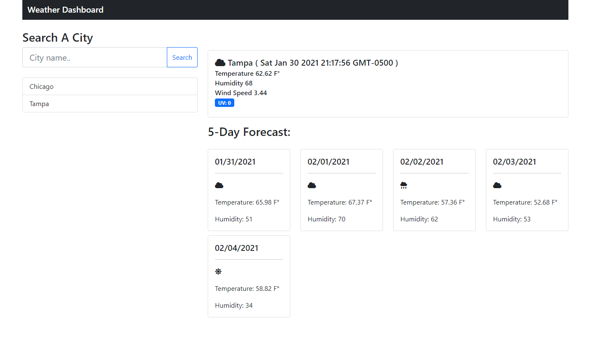

# Weather-Dashboard

This Project is designed to provide a real-time weather forecast for a given city, displaying both current and a 5-day weather data.
The project features are as follows

- Search Bar to lookup real-time weather data using the openweather.org API
- A list of previous searches that are clickable and will provide data on that City
- A current weather report for a searched city
- A 5-day forecast for the searched city, displaying the weather overview, Temp, and Humidity

